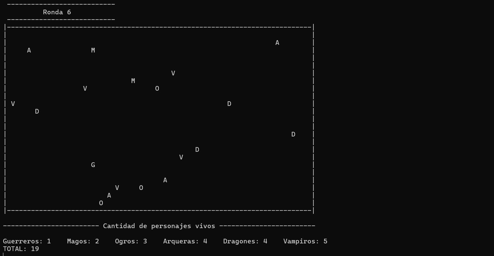

# Battle Royale

Este proyecto consiste en una simulación por consola de *Battle Royale* desarrollada en C++ donde participan múltiples personajes de distintas clases que se atacan hasta que quede uno o todos mueran.

## Descripción del juego
En la partida participan personajes de distintos tipos (Guerrero, Mago, Ogro, Arquera, Dragón y Vampiro), que se colocan en un mapa representado mediante una matriz bidimensional. Cada personaje cuenta con atributos como vida, ataque y posición, y puede equiparse con diferentes objetos que modifican sus estadísticas, todos ellos mostrados en consola y personalizables.

Durante cada turno, los personajes se mueven por el mapa, escanean su entorno y atacan a otros personajes cuando se encuentran en posiciones colindantes. La partida avanza de forma automática hasta que solo queda un personaje con vida que es declarado ganador o todos mueran.

Como elemento complicación en este Battle Royale, el mapa se va *reduciendo progresivamente*, obligando a los personajes a desplazarse hacia el centro y aumentando la frecuencia de los combates.

## Objetivos del proyecto

Los principales objetivos de este proyecto son:

- Crear un juego estilo Battle Royale que permita seleccionar un número de personajes y personalizarlos añadiendo equipamiento.
- Diseñar la clase *Partida* que simulará la batalla.
- Aplicar la herencia para crear diferentes tipos de personajes y equipamientos.
- Implementar lógica de movimiento, combate y eliminación de personajes.
- Crear una *interfaz por consola* para configurar y simular el juego.

## Estructura del proyecto

El proyecto se ha estructurado pensando en la claridad y mantenimiento de código, separando diferentes responsabilidades en distintos archivos.

- *battle-royale.cpp*  
  Contiene la función main, desde donde se crea el objeto Partida y se inicia el juego.

- *Partida.h / .cpp*
  Se encarga de configurar la partida, inicializar el mapa, gestionar los turnos, reducir el tamaño de la matriz y controlar el fin de la partida.

- *Personaje.h / .cpp*  
  Representa a los jugadores del Battle Royale. Controla atributos como vida, ataque y posición, además de acciones como moverse, atacar y recibir daño.

- *TiposDePersonajes.h*  
  Clases como Guerrero, Mago, Ogro, Arquera, Dragon y Vampiro heredan de Personaje, permitiendo ampliar fácilmente el juego con nuevos tipos y facilitando el polimorfismo.

- *Equipamiento.h / .cpp* 
  Estructura los objetos que pueden usar los personajes para aumentar su valor de ataque o defensa.

- *TiposDeEquipamientos.h*  
  Objetos como Espada, Escudo, ArcoEncantado o PocionDeRabia heredan de Equipamiento.

## Interfaz

El juego cuenta con una *interfaz por consola sencilla.*

A través del menú, el usuario puede:
- Seleccionar el número de personajes por cada tipo.
- Elegir que equipamiento tendrá cada tipo.
- Visualizar la partida y los totales.

Durante la ejecución, el estado del juego se muestra mediante el numero de ronda, la matriz del mapa y el recuento de cada personaje.

Esta interfaz simple permite llevar un seguimiento de lo que ocurre en la partida.

## Organización general (por clases)

### Clase Partida

* Inicializa el menú inicial y pide al usuario que elija los valores iniciales.

* Gestiona los turnos y la coherencia del mapa.

* Controla que el mapa se reduzca cada 8 rondas.

* Termina la partida cuando quede un personaje o hayan muerto todos.

#### Atributos:

* `limSuperior`, `limInferior`, `limIzquierda`, `limDerecha`
* `maxPersonajes`: Cantidad máxima de personajes que se pueden elegir por cada tipo.
* `ronda`
* `rondasParaCierre`: Cada cuantas rondas se aplicará el cierre del área de juego.
* `rondasParaAviso`: Cuantas rondas antes se avisará a los personajes que se va a cerrar el área.
* `matriz`
* `matrizDeIds`: Matriz que guardará los ids de los personajes en sus correspondientes posiciones. 
* `personajes`
* `cantidadGuerreros`, `cantidadMagos`, `cantidadOgros`, `cantidadArqueras`, `cantidadDragones`, `cantidadVampiros`

### Clase Personaje

Define los atributos y métodos de los personajes y controla su movimiento y ataque.

#### Atributos:

* `id`: identificador del personaje
* `nombre`, `alias`
* `ataque`: valor de daño
* `vida`, `vidaMax`
* `equipamiento`
* `x`, `y`: posición en el mapa

### Clases Guerrero, Mago, Ogro, Arquera, Dragon, Vampiro
Estas clases heredan de _Personaje_ e inicializan sus valores por defecto (vida, ataque y equipamiento) dependiendo del tipo de personaje y lo que haya escogido el usuario.

### Clase Equipamiento
Define los atributos de los equipamientos.

#### Atributos:

* `codigo`
* `nombre`
* `ataque`
* `vida`

### Clases Espada, Escudo, CapaIgnifuga, RedAntiflechas, ArcoEncantado, Mazo, Amuleto, PocionDeRabia
Estas clases heredan de _Equipamiento_ e inicializan sus valores por defecto.

## Mapa del juego

El escenario se representa en una matriz 25x40, donde cada celda podrá tener el alias de un personaje o un espacio vacío. 
Los personajes se mueven según los límites del mapa, los cuales se reducirán cada 8 rondas. 

Para controlar fácilmente tanto los límites como los personajes adyacentes, se utiliza una matriz de identificadores (`matrizDeIds`) que almacena el id del personaje en su posición correspondiente. 

Gracias a esta estructura del mapa de juego, se ha conseguido reducir la complejidad temporal del movimiento y búsquedas de  O(n²) a O(n).

## Reducción progresiva de mapa

Como _complicación extra_ para nuestro proyecto hemos añadido una reducción de la arena de combate, de manera que cualquier personaje que esté fuera quede eliminado automáticamente. Para ello, hemos creado la función **cerrarArea()** ,el cual va sobrescribiendo la parte mas externa del área con ## cada 8 rondas. Esto da un efecto de zona peligrosa o zona con tormenta. Internamente, en la matriz de ids se sustituyen los -1 que representan los espacios vacios del area, por -2 que representa la zona invadida por la tormenta. Además hemos implementado un booleano llamado **irAlCentro** que propicia que, cuando su valor es **true**, el personaje intente acercarse al centro. Esto ocurre durante las 3 últimas rondas de las 8 debido a que son las rondas de aviso de que el mapa va a cerrarse.

## Sistema de combate

Cuando dos personajes entran en contacto, comienzan un combate. Durante este duelo, ninguno de los dos se moverá hasta acabarlo, y el valor de ataque de cada uno se irá restando a la vida del otro, lo cual acabará con la muerte de uno de ellos, o, en algunos casos, incluso de ambos. En caso de haber recibido daño, y si no están dentro de un combate los personajes recuperarán una pequeña cantidad de salud cada vez que se muevan de posición.

## Final de la partida

Cuando en la zona solo quede un personaje vivo (o ninguno), se procederá al final de la partida. La tormenta cesará y se anunciará el personaje ganador, o en caso de no haberlo, se indicará que todos han muerto.

## Ejecución

Para ejecutar el código únicamente hay que pulsar el botón de *Play* en Visual Studio.

## Sistema de colaboración
Para facilitar la colaboración en el proyecto utilizamos el sistema de control de versiones de **git**, con la plataforma **gitHub**. 

Repositorio del proyecto:  
https://github.com/olaaaiap/battle-royale

## Autores

Los autores de este proyecto han sido Rodrigo Jiménez Vielba, Olaia Picabea Sainz y Álvaro Quintanilla Carrasco.

